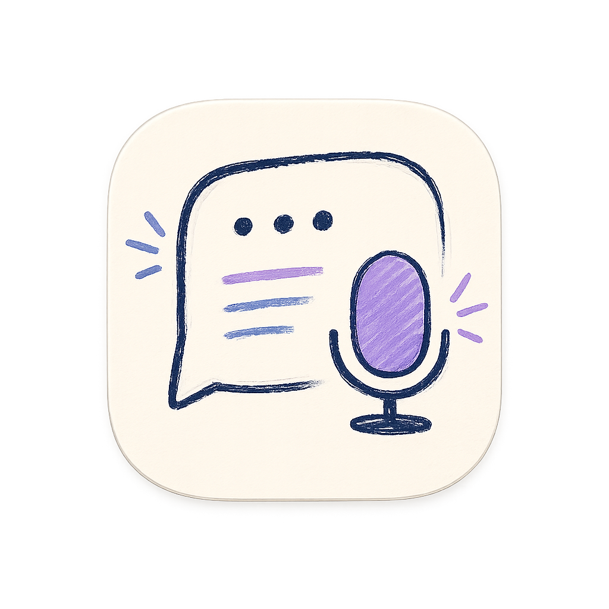

<div align="center">
  

  [简体中文](./README.md) | [English](./README_EN.md)

  # InterviewAssistant

  **A local-first, open-source AI interview preparation and assistance tool for Apple platforms**

  Speech recognition · Real-time answers · Personal knowledge bases · Screenshot Q&A · Mock interviews · Local review

  [Features](#features) · [Quick Start](#quick-start) · [Model Setup](#choosing-an-ai-model) · [User Guide](#user-guide) · [Data & Privacy](#data-storage-and-privacy) · [FAQ](#faq)
</div>

> [!IMPORTANT]
> This project is intended for interview practice, knowledge organization, and assistance in situations where such use is permitted. Before using real-time prompts, recording, system audio, or screen capture, make sure you comply with the interviewer's rules, local laws, and third-party service terms. Do not use it for deception, impersonation, or unauthorized recording.

## About the Project

InterviewAssistant, displayed as **Interview AI** inside the app, is built with SwiftUI and supports macOS. It helps you:

- Organize the target role, job description, company information, and personal experience before an interview;
- Create multiple personal knowledge bases and decide which materials the AI may use in each interview;
- Recognize speech, analyze screenshots, and generate suggested answers in a floating macOS prompt panel;
- Run mock interviews with per-question feedback, suggested answers, and an overall evaluation;
- Review real and mock interview history locally on your device.

AI requests are sent directly from the app to the model provider selected by the user.

> [!NOTE]
> “Local-first” does not mean every configuration is fully offline. When you use OpenAI, Claude, DeepSeek, Gemini, Volcengine Ark, or Doubao Speech, the text, relevant knowledge-base context, screenshots, or audio required for the request is sent directly to that provider. To minimize data leaving your device, use **Ollama + Apple on-device speech recognition**.

## Screenshots

### Interview Preparation

Enter the target role, job description, and company information, then choose the knowledge bases available for the interview.

<p align="center">
  
</p>

### macOS Live Prompt Panel

The floating panel displays recognized questions, AI-generated answers, and screenshot analysis results.

<p align="center">
  
</p>

The panel can be minimized to cover less of the screen.

<p align="center">
  
</p>

## Features

### Interview Preparation

- Enter a target role and job description;
- Record the company name, website, and notes;
- Generate a company research summary with the currently configured model;
- Enable one or more knowledge bases for an interview;
- Automatically preserve the latest workspace draft;
- Start a real or mock interview from the same entry point.

### macOS Live Prompt Panel

- Display transcripts and suggested answers in a separate floating window;
- Use microphone or system-audio input;
- Choose Apple speech recognition or Doubao streaming speech recognition;
- Stream AI responses as they are generated;
- Expand, minimize, keep the panel on top, and adjust text size;
- Attempt to hide the panel from screenshots or screen sharing;
- Use Chinese or English with light and dark themes.

### Director Mode

- Use one device as a Director controller on the same local network and send questions or Markdown answers to the Host prompt panel;
- Display the local IP address and a connection QR code for quick setup from another device;
- Switch between AI and Director modes while synchronizing whether the Host prompt panel is open;
- Use either macOS or iOS / iPadOS as the controller or Host.

### On-device Speaker Recognition

- Use the local 3D-Speaker CAMPPlus model to distinguish the candidate from the interviewer and reduce false question triggers from the candidate's own answers;
- Save multiple voices, rename them, and freely switch the active voice;
- Select **None** to disable recognition without deleting enrolled voiceprints;
- Keep recording, embedding extraction, and comparison on device without retaining or uploading enrollment audio.

### Screenshot Q&A

- Set a fixed capture region before the interview;
- Manually select an area for every screenshot instead;
- Use the default macOS shortcut `⌘ Command + ⇧ Shift + S`;
- Capture multiple regions before analyzing them together;
- Store screenshots, questions, and answers in local history.

### Local Knowledge Bases

- Create multiple independent knowledge bases;
- Manually add, edit, enable, or disable knowledge entries;
- Import PDF, TXT, Markdown, RTF, HTML, JSON, DOC, and DOCX files;
- Import public webpages or GitHub links;
- Review text extracted from imported sources;
- Enable different knowledge bases for different interviews;
- Keep the detail panel empty when no knowledge base exists, entering edit mode only after “New Material” is selected.

### Mock Interviews and Review

- Generate questions from the role, job description, company information, and knowledge bases;
- Choose between 3 and 10 questions per session;
- Answer in Chinese, English, or the current app language;
- Record and submit each response;
- Receive a score, feedback, and a suggested answer;
- Review strengths, improvement areas, and an overall evaluation;
- Export a mock interview evaluation as PDF;
- View real and mock interview records together in History.

## Platform Differences

| Feature | macOS | iOS / iPadOS |
| --- | :---: | :---: |
| Interview preparation, knowledge bases, and history | ✅ | ✅ |
| Mock interviews | ✅ | ✅ |
| AI model configuration | ✅ | ✅ |
| Apple speech recognition | ✅ | ✅ |
| On-device speaker recognition and multiple voices | ✅ | ✅ |
| Director Mode local-network control | ✅ | ✅ |
| Floating prompt panel | ✅ | — |
| System-audio capture | ✅ | — |
| Preset screenshot region and global shortcut | ✅ | — |
| Connect to Ollama on the local network | ✅ | ✅ |

## Requirements

- macOS 14.0 or later, or iOS / iPadOS 17.0 or later;
- Xcode 16 or a later version compatible with Swift 6 when building from source;
- Microphone, speech recognition, and screen/system-audio recording permissions for the full macOS feature set;
- Ollama and at least one downloaded local model when using Ollama;
- Your own credentials and a network connection when using an external model or Doubao Speech.

## Quick Start

Regular users can download the signed and Apple-notarized macOS installer from [GitHub Releases](https://github.com/pennyzhaozhao/AI-interview-Assistant/releases). Developers can also build the project from source.

### 1. Clone the Repository

```bash
git clone https://github.com/pennyzhaozhao/AI-interview-Assistant.git
cd AI-interview-Assistant
```

### 2. Open the Project

```bash
open InterviewAssistant.xcodeproj
```

The project does not include Firebase, Google Sign-In, Supabase, or Cloudflare Workers and does not require their SDKs.

### 3. Configure Signing

In Xcode, select:

1. The `InterviewAssistant` project;
2. The `InterviewAssistant` target;
3. `Signing & Capabilities`;
4. Your own Development Team;
5. Replace the default `com.pennyzhaozhao.interviewassistant` with a unique Bundle Identifier that you control.

A Personal Team is sufficient for local development. Public distribution requires your own Apple Developer identity for signing and notarization.

### 4. Run

- macOS: select `My Mac`;
- iOS / iPadOS: select a simulator or physical device;
- Select the `InterviewAssistant` scheme;
- Press `⌘R` to build and run.

## Recommended First-Launch Setup

Complete setup in this order:

1. Choose the interface language and theme under **Settings → Appearance**;
2. Confirm or change the local data directory under **Settings → Data Storage**;
3. Choose Apple or Doubao speech recognition under **Settings → API Configuration → Speech Recognition**;
4. Choose an AI provider and model under **Settings → API Configuration**;
5. Save the configuration and run “Test Connection” once;
6. Grant the required permissions in macOS System Settings;
7. Create a knowledge base, enter a target role and job description, and start your first interview.

## Choosing an AI Model

The current version uses one **global model configuration**. Real interviews, screenshot Q&A, company research, and mock interviews all use the most recently saved provider and model.

Open:

```text
Settings → API Configuration
```

Then:

1. Select Ollama, DeepSeek, OpenAI, Claude, Gemini, or Volcengine Ark under Provider;
2. Select a specific model under Current Model;
3. Check the API URL;
4. Enter the API key for that provider;
5. Select Test Connection;
6. Select Save after the test succeeds.

The API URL, model, and API key are stored separately for each provider. When switching back to a previously configured provider, you do not need to re-enter everything. The last provider you save becomes the active provider.

> [!NOTE]
> The home screen does not currently provide a per-interview model selector. To change models, switch and save the model under **Settings → API Configuration** first. The current version only guarantees that models included in the built-in model lists can be selected and applied through the interface.

### Built-in Providers

| Provider | Default API URL | Built-in model examples | API key |
| --- | --- | --- | --- |
| Ollama | `http://localhost:11434/v1` | `qwen2.5:7b`, `llama3.1:8b`, `qwen2.5:14b` | Usually not required |
| DeepSeek | `https://api.deepseek.com` | `deepseek-flash`, `deepseek-v4-pro` | Required |
| OpenAI | `https://api.openai.com/v1` | `gpt-4.1-mini`, `gpt-4.1`, `gpt-4o-mini`, `gpt-4o` | Required |
| Claude | `https://api.anthropic.com/v1/messages` | `claude-sonnet-4-5`, `claude-opus-4-1`, `claude-haiku-4-5` | Required |
| Gemini | `https://generativelanguage.googleapis.com/v1beta` | `gemini-2.0-flash`, `gemini-2.5-pro` | Required |
| Volcengine Ark | `https://ark.cn-beijing.volces.com/api/v3` | `doubao-seed-1-8-251228` and others | Required |

Model names and provider interfaces may change. If a connection fails, check the provider console first and confirm that your account has access to the selected model.

## Configuring a Local Ollama Model

The default macOS endpoint is:

```text
http://localhost:11434/v1
```

Example:

```bash
ollama pull qwen2.5:7b
ollama serve
```

Then, in the app:

1. Select **Ollama** as the provider;
2. Set the API URL to `http://localhost:11434/v1`;
3. Select a downloaded model;
4. Leave the API key empty;
5. Select Test Connection;
6. Select Save.

To connect an iPhone or iPad to Ollama running on a Mac, both devices must be on the same trusted local network. Use the Mac's local network address, for example:

```text
http://192.168.1.10:11434/v1
```

Allow Ollama to listen on the local network:

```bash
OLLAMA_HOST=0.0.0.0 ollama serve
```

Only expose this port on a trusted network, and configure the macOS firewall as needed.

## Configuring Speech Recognition

Speech recognition and the answer model are configured separately. You can combine local speech recognition with an external model, or external speech recognition with Ollama.

### Apple Speech Recognition

Open **Settings → API Configuration → Speech Recognition** and select **Apple On-Device Recognition**.

- No third-party speech API credentials are required;
- Setup is simple;
- It can reduce the amount of audio leaving the device;
- Language support and offline availability depend on the OS version, region, and installed speech resources.

### Doubao Speech Recognition

If Apple speech recognition does not meet your needs, connect directly to Doubao Speech:

1. Create an application in the Volcengine / Doubao Speech console;
2. Enable the appropriate streaming speech recognition product;
3. Copy the `App ID` and `Access Token`;
4. Select **Doubao Speech Recognition 2.0** in the app;
5. Select the same recognition model configured in the provider console;
6. Test the connection and save.

Common resource IDs:

```text
volc.seedasr.sauc.duration
volc.seedasr.sauc.concurrent
```

Refer to the provider console for current resource IDs, permissions, and pricing. Audio is sent directly from the device to that provider when Doubao Speech is enabled.

## macOS Permissions

| Permission | Purpose | System Settings location |
| --- | --- | --- |
| Microphone | Capture the user or an external audio device | Privacy & Security → Microphone |
| Speech Recognition | Use Apple Speech | Privacy & Security → Speech Recognition |
| Screen & System Audio Recording | Capture system audio and screenshots | Privacy & Security → Screen & System Audio Recording |
| Local Network | Connect to Ollama or another device on the LAN | Privacy & Security → Local Network |

If a feature still does not respond after permission is granted, fully quit and reopen the app. Changing the signing identity or Bundle Identifier may cause macOS to treat the build as a new app and request permission again.

## User Guide

### Create and Select a Knowledge Base

1. Open **Knowledge Base** in the sidebar;
2. Select New Material;
3. Enter a name and description, then save;
4. Add the main content manually, upload a file, or import a public link;
5. Check that the extracted text is correct;
6. Use the switch on a knowledge-base card to decide whether it can be used during interviews;
7. Return to the interview home screen and confirm which knowledge bases are enabled.

When no knowledge base exists or is selected, the detail panel remains empty. Deleting the final knowledge base will not leave behind an unsavable empty form.

For each project, consider organizing at least: context, goals, personal responsibilities, key actions, trade-offs, outcomes, failures, and lessons learned. Do not import confidential material that you are not authorized to send to an external model.

### Start a Real Interview

1. Confirm the active model under **Settings → API Configuration**;
2. Enter the target role and job description on the home screen;
3. Optionally enter the company name, website, and notes;
4. Manually review any generated company summary;
5. Select the knowledge bases that may be used during this interview;
6. Select Start Interview;
7. Choose microphone, system audio, or mute in the macOS prompt panel;
8. Review the session under History when finished.

### Use the Floating Prompt Panel

The panel supports three audio states:

- **Microphone**: recognize the current microphone input;
- **System Audio**: recognize audio played by meeting software, a browser, or another app;
- **Mute**: stop speech recognition while keeping screenshot Q&A available.

“Hide panel during screen sharing” depends on the capture behavior of macOS and the screen-recording application. It cannot be guaranteed to remain invisible with every OS version and application. Test your setup before real use.

### Use Screenshot Q&A

Preset-region mode:

1. Open **Settings → Screenshot Mode**;
2. Grant screen recording permission;
3. Select Preset Region Screenshot;
4. Select Set Region before the interview;
5. Press `⌘⇧S` or use the screenshot button in the prompt panel;
6. Continue capturing other regions if needed;
7. Analyze all captures together when ready.

Manual-selection mode asks you to select a region for every capture and is useful when the page layout changes frequently. If the shortcut conflicts with another app, record a different shortcut in Settings.

### Run a Mock Interview

1. Confirm the active AI model in Settings;
2. Enter the role and job description on the home screen;
3. Select the knowledge bases to use;
4. Select Mock Interview;
5. Choose 3–10 questions and an answer language;
6. Record and submit each answer;
7. Review the score, feedback, and suggested answer;
8. Review the overall summary when finished;
9. Export the evaluation as PDF if needed.

### Review and Delete History

History contains both real and mock interview sessions. You can search and review conversations, scores, screenshots, and suggested answers, or delete sessions that you no longer need.

## Data Storage and Privacy

### Custom Data Directory

Open:

```text
Settings → Data Storage
```

You can view the current directory, select a new folder, or erase user data. On macOS, you can also open the current directory directly in Finder.

When selecting a new location:

1. The app creates an `InterviewAssistantData` subdirectory in the selected folder;
2. Existing history, knowledge-base data, and saved screenshots are copied to the new directory;
3. Fully quit and reopen the app after the move completes;
4. The old database files are cleaned up after the new database becomes available.

“Erase All Data” removes interview history, knowledge bases, and saved screenshots. It does not remove API keys from Keychain or reset app preferences such as language and theme.

> [!NOTE]
> In the current version, knowledge entries and extracted text are stored in the selected SwiftData database. To support PDF previews, local copies of imported files may still exist in the app's Application Support directory. Before deleting sensitive source files, check both the selected data directory and the app data directory.

### Data Flow

| Data | Default storage | When it leaves the device |
| --- | --- | --- |
| API keys and ASR credentials | Apple Keychain | Used to authenticate with the selected provider |
| Knowledge entries and extracted text | SwiftData; movable from Settings | When relevant context is sent to the selected external model |
| Real and mock interview history | SwiftData; movable from Settings | When relevant content is used in an external model request |
| Historical screenshots | External data managed by SwiftData; moves with the database | When a screenshot question is sent to an external model |
| Imported PDF preview copies | Local Application Support directory | When PDF content is included in an external model request |
| Language, theme, and shortcuts | UserDefaults | Not actively uploaded |
| Microphone / system audio | Recognition pipeline memory | Sent to the selected provider when external ASR is used |

The project maintainer does not operate a server that receives this data. How third-party model and speech providers process data depends on the provider selected by the user and its privacy policy.

## FAQ

### I do not know which model is active

Open **Settings → API Configuration**. Provider and Current Model show the global active configuration. The last provider saved is used for future real interviews, mock interviews, screenshot Q&A, and company research.

### My API key is missing or still reported as missing after saving

- Confirm that the API key belongs to the active provider;
- Enter it again and select Save;
- If the Bundle Identifier or signing identity changed, the Keychain access context may have changed and the key may need to be saved again;
- Ollama usually does not need an API key, but the local service must be running.

### Ollama cannot connect

- Run `ollama list` and confirm that the required model is downloaded;
- Run `ollama serve` and confirm that the service is running;
- Use `http://localhost:11434/v1` on macOS;
- On iOS, use the Mac's local IP address, not the iPhone's own `localhost`;
- Check the macOS firewall and Local Network permission.

### System audio is not recognized

- Grant Screen & System Audio Recording permission;
- Fully quit and reopen the app;
- Confirm that the prompt panel is in System Audio mode;
- Confirm that the target application is playing sound;
- Check the active output device in Zoom, Teams, or other meeting software.

### Apple speech recognition is unavailable

- Grant Microphone and Speech Recognition permissions;
- Check whether the selected language is supported by the system;
- Download the required system speech resources;
- Confirm that the selected input device can record audio.

### The screenshot shortcut does not respond

- Check whether the shortcut conflicts with another application;
- Record a new shortcut in Settings;
- Grant Screen & System Audio Recording permission;
- Save a screenshot region before using preset mode;
- Try manual-selection mode.

### Company website analysis fails

- Confirm that the URL includes `https://`;
- Some websites block fetching or require client-side browser rendering;
- Check the connection status of the active model;
- If automatic analysis is unavailable, enter trusted information manually in the company notes.

### The old directory still appears after changing the data location

- Confirm that folder access was not cancelled during selection;
- Wait for the app to report that copying succeeded;
- Fully quit InterviewAssistant instead of only closing the window;
- Reopen the app and check **Settings → Data Storage** again;
- Do not manually move `.store`, `-wal`, or `-shm` files while the app is running.

## On-device Speaker Recognition and Privacy

Open **Settings → Speaker Recognition → Set Up Voices** to download the 28.3 MB 3D-Speaker CAMPPlus model, then read for about 15 seconds using the microphone you will use in interviews. Enrollment creates a voice embedding and RMS baseline. The biometric embedding is encrypted in Apple Keychain; enrollment audio is not retained, and speaker inference or comparison never uploads audio. A model-version change requires re-enrollment.

Voice management follows a Touch ID-style flow: use **Add Voice…** to enroll multiple voices, rename each entry, and freely select the active voice. Selecting **None** disables speaker recognition without deleting enrolled voices; selecting a saved voice enables it again. A voiceprint saved by an older version is automatically migrated into the new list.

Audio shorter than 1.2 seconds is conservatively classified as unknown. Similar voices, background noise, microphone distance, and room changes can reduce accuracy, so enroll each voice with the microphone and environment intended for the interview.

The implementation pins `sherpa-onnx 1.13.6` (Apache-2.0) and its `onnxruntime-libs 1.27.1` dependency (ONNX Runtime is MIT). The current upstream 1.13.8 macOS binary archive fails framework-symlink validation with some Xcode versions, so 1.13.6 is pinned for now. The recommended `3dspeaker_speech_campplus_sv_zh-cn_16k-common.onnx` model comes from the Apache-2.0 3D-Speaker project and is verified with SHA-256 after download.

## Technology Stack

| Area | Technology |
| --- | --- |
| Client | Swift 6, SwiftUI, SwiftData |
| macOS audio | AVFoundation, ScreenCaptureKit |
| Local speech | Apple Speech framework |
| Local voiceprint | sherpa-onnx, 3D-Speaker CAMPPlus |
| Optional external speech | Doubao / Volcengine streaming ASR over WebSocket |
| Credentials | Apple Keychain |
| Document processing | PDFKit and system document import capabilities |
| Local models | Ollama (OpenAI-compatible API) |
| External models | OpenAI, Claude, DeepSeek, Gemini, Volcengine Ark |

## Project Structure

```text
.
├── InterviewAssistant/
│   ├── History/                  # Real and mock interview history
│   ├── KnowledgeBase/            # Knowledge bases, document import, and PDF preview
│   ├── MockInterview/            # Mock interviews, scoring, and PDF export
│   ├── Receiver/                 # Floating panel, audio, ASR, and screenshots
│   ├── Resources/                # Info.plist, permissions, and assets
│   ├── Sender/                   # Experimental LAN prompt-sending module
│   ├── Settings/                 # Appearance, data directory, shortcuts, and API setup
│   ├── Shared/                   # Data models, Keychain, AI, and shared services
│   └── Setup/                    # Interview preparation workflow
├── InterviewAssistant.xcodeproj/ # Xcode project
├── presentation img/             # README screenshots
├── scripts/build-dmg.sh           # macOS DMG build script
├── DESIGN_SYSTEM.md               # UI design guidelines
├── LICENSE                        # MIT License
├── README.md                      # Simplified Chinese README
└── README_EN.md                   # English README
```

## Building a macOS DMG

Local preview build:

```bash
./scripts/build-dmg.sh
```

Developer ID signing and automatic Apple notarization:

```bash
SIGNED_RELEASE=1 \
NOTARY_PROFILE=InterviewAssistant-notary \
./scripts/build-dmg.sh
```

`NOTARY_PROFILE` is the name of credentials saved to Keychain with `xcrun notarytool store-credentials`. Build artifacts are written to `dist/`. Before public distribution, confirm that:

1. Your own Developer ID Application certificate is used;
2. Apple Notary Service returns `Accepted`;
3. The notarization ticket is successfully stapled and validated;
4. Installation and first-run permissions are tested on a Mac without a development environment;
5. The artifact contains no API keys, personal certificates, or local databases.

## Development and Security Notes

- Document where data is sent whenever adding an external request;
- Never commit API keys, tokens, certificates, configuration secrets, or personal databases;
- Keep provider URLs, authentication, and response parsing centralized in `AIService.swift`;
- Design a migration path for existing users whenever changing SwiftData models;
- Update `Info.plist`, entitlements, and the README together when changing permissions;
- Verify at least the macOS and iOS builds before committing;
- `.gitignore` excludes databases, credentials, Xcode user data, and common build artifacts.

If you discover leaked credentials, exposed private data, or another security issue, do not paste sensitive details into a public Issue. Start with a report that contains no sensitive information, then continue through a security contact publicly provided by the repository maintainer.

## Contributing

Issues and pull requests are welcome:

1. Fork the repository;
2. Create a feature branch;
3. Implement the change and necessary tests;
4. Confirm that the commit contains no personal information, credentials, or local databases;
5. Explain the motivation, implementation, and verification in the pull request.

Example:

```bash
git checkout -b feature/your-feature
git commit -m "feat: describe your change"
git push origin feature/your-feature
```

## License

This project is available under the [MIT License](./LICENSE). You may use, copy, modify, and distribute the code, but the software is provided “as is,” without warranty of any kind.

---

If this project helps you, consider starring the repository, sharing feedback, or contributing improvements to the local interview workflow.
